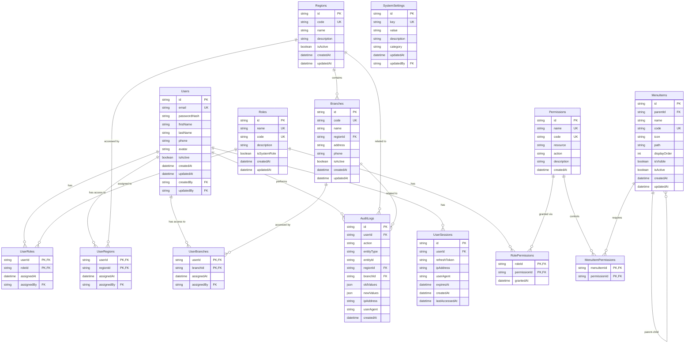

# Week 1-3 Implementation Plan & Complete API System

## Table of Contents

1. [Week 1-2: Foundation Implementation](#week-1-2-foundation-implementation)
2. [Week 3: Integration Implementation](#week-3-integration-implementation)
3. [Database Schema Design](#database-schema-design)
4. [API Endpoints Specification](#api-endpoints-specification)
5. [Mock API Server Setup](#mock-api-server-setup)
6. [Backend Technology Stack](#backend-technology-stack)
7. [Frontend Integration Guide](#frontend-integration-guide)
8. [JWT Token Structure](#jwt-token-structure)

---

## Week 1-2: Foundation Implementation

### Day 1-2: Authentication Context & Types

#### Task 1.1: Create Type Definitions

**File**: `src/types/auth.ts`

```typescript
export interface User {
  id: string;
  email: string;
  firstName: string;
  lastName: string;
  phone?: string;
  avatar?: string;
  isActive: boolean;
  roleId: string;
  role: Role;
  regions: UserRegion[];
  createdAt: string;
  updatedAt: string;
}

export interface Role {
  id: string;
  name: string;
  code: string;
  description?: string;
  permissions: Permission[];
}

export interface Permission {
  id: string;
  name: string;
  code: string;
  resource: string;
  action: string;
}

export interface UserRegion {
  userId: string;
  regionId: string;
  region: Region;
  branches: UserBranch[];
}

export interface Region {
  id: string;
  code: string;
  name: string;
  description?: string;
  branches: Branch[];
}

export interface Branch {
  id: string;
  code: string;
  name: string;
  regionId: string;
  address?: string;
  phone?: string;
  isActive: boolean;
}

export interface UserBranch {
  userId: string;
  branchId: string;
  branch: Branch;
}

export interface LoginRequest {
  email: string;
  password: string;
  rememberMe?: boolean;
}

export interface LoginResponse {
  accessToken: string;
  refreshToken: string;
  expiresIn: number;
  user: User;
}

export interface RefreshTokenRequest {
  refreshToken: string;
}

export interface RefreshTokenResponse {
  accessToken: string;
  expiresIn: number;
}
```

**File**: `src/types/api.ts`

```typescript
export interface ApiResponse<T> {
  success: boolean;
  data: T;
  message?: string;
  errors?: Record<string, string[]>;
}

export interface PaginatedResponse<T> {
  items: T[];
  totalCount: number;
  pageNumber: number;
  pageSize: number;
  totalPages: number;
  hasPreviousPage: boolean;
  hasNextPage: boolean;
}

export interface ApiError {
  statusCode: number;
  message: string;
  errors?: Record<string, string[]>;
  timestamp: string;
  path: string;
}
```


#### Task 1.2: Create AuthContext

**File**: `src/context/AuthContext.tsx`

- Implement JWT token storage (localStorage/sessionStorage)
- Token refresh logic with automatic retry
- Auto-logout on token expiry
- Session persistence based on "Remember Me"
- User data management
- Loading and error states

**Key Features**:

- `login(email, password, rememberMe)`
- `logout()`
- `refreshToken()`
- `isAuthenticated` computed property
- `currentUser` state
- `hasPermission(permissionCode)` helper
- `hasRole(roleCode)` helper

#### Task 1.3: Update Main App

**File**: `src/main.tsx`

- Wrap app with `AuthProvider`
- Add token refresh interval
- Handle token expiry globally

### Day 3-4: Protected Routes & Route Guards

#### Task 2.1: Create ProtectedRoute Component

**File**: `src/components/auth/ProtectedRoute.tsx`

```typescript
interface ProtectedRouteProps {
  children: ReactNode;
  requiredRole?: string;
  requiredPermission?: string;
  fallback?: ReactNode;
}
```


- Check authentication status
- Check role requirements
- Check permission requirements
- Redirect to login if unauthenticated
- Show access denied if unauthorized

#### Task 2.2: Create RequirePermission Component

**File**: `src/components/common/RequirePermission.tsx`

- Component-level permission guard
- Hide/show UI elements based on permissions
- Support multiple permissions (AND/OR logic)

#### Task 2.3: Update App Routes

**File**: `src/App.tsx`

- Wrap dashboard routes with `ProtectedRoute`
- Add role-based route protection
- Create public routes array
- Add permission-based route guards

### Day 5-7: Authentication Forms Enhancement

#### Task 3.1: Install Dependencies

```bash
npm install react-hook-form zod @hookform/resolvers axios
```


#### Task 3.2: Create Validation Schemas

**File**: `src/utils/validation/schemas.ts`

- Login schema (email, password)
- Register schema (email, password, confirmPassword, firstName, lastName)
- Forgot password schema (email)
- Reset password schema (token, password, confirmPassword)

#### Task 3.3: Update SignInForm

**File**: `src/components/auth/SignInForm.tsx`

- Integrate react-hook-form
- Add zod validation
- Connect to login API
- Handle loading states
- Display API errors
- Implement "Remember Me" functionality
- Add OAuth button handlers (structure for future)

#### Task 3.4: Update SignUpForm

**File**: `src/components/auth/SignUpForm.tsx`

- Add comprehensive validation
- Password strength indicator
- Email format validation
- Connect to register API

#### Task 3.5: Create Forgot/Reset Password Forms

**File**: `src/components/auth/ForgotPasswordForm.tsx`**File**: `src/components/auth/ResetPasswordForm.tsx`

### Day 8-10: Role-Based Access Control

#### Task 4.1: Create Permission Utilities

**File**: `src/utils/permissions.ts`

- `hasPermission(user, permissionCode)`
- `hasRole(user, roleCode)`
- `hasAnyPermission(user, permissionCodes)`
- `hasAllPermissions(user, permissionCodes)`
- `filterByPermissions(items, user)`

#### Task 4.2: Update Sidebar

**File**: `src/layout/AppSidebar.tsx`

- Fetch menu from API (dynamic menu)
- Filter menu items based on user permissions
- Show/hide menu items dynamically
- Support nested menu structure

#### Task 4.3: Update Header

**File**: `src/layout/AppHeader.tsx`

- Display current user info from AuthContext
- Show user's regions/branches in dropdown
- Add logout functionality

### Day 11-14: API Client & Services

#### Task 5.1: Install Dependencies

```bash
npm install axios
```


#### Task 5.2: Create API Client

**File**: `src/services/api/client.ts`

- Axios instance with base URL from env
- Request interceptor (add JWT token)
- Response interceptor (handle errors, refresh token)
- Error handling (401 → logout, 403 → access denied, 500 → server error)
- Request timeout configuration
- Retry logic for network errors

#### Task 5.3: Create Auth Service

**File**: `src/services/api/auth.ts`

- `login(credentials)`
- `logout()`
- `refreshToken(token)`
- `forgotPassword(email)`
- `resetPassword(token, password)`
- `getCurrentUser()`

#### Task 5.4: Create User Service

**File**: `src/services/api/users.ts`

- `getUsers(params)` - with pagination, filtering, sorting
- `getUserById(id)`
- `createUser(userData)`
- `updateUser(id, userData)`
- `deleteUser(id)`
- `assignRegions(userId, regionIds)`
- `assignBranches(userId, branchIds)`
- `updateUserRole(userId, roleId)`

#### Task 5.5: Create Region Service

**File**: `src/services/api/regions.ts`

- `getRegions(params)`
- `getRegionById(id)`
- `getRegionBranches(regionId)`

#### Task 5.6: Create Branch Service

**File**: `src/services/api/branches.ts`

- `getBranches(params)`
- `getBranchById(id)`
- `getBranchesByRegion(regionId)`

#### Task 5.7: Create Menu Service

**File**: `src/services/api/menu.ts`

- `getUserMenu()` - fetch user's accessible menu items
- `getMenuTree()` - get full menu hierarchy

#### Task 5.8: Environment Configuration

**File**: `.env.example`

```javascript
VITE_API_BASE_URL=http://localhost:3001/api
VITE_API_TIMEOUT=30000
VITE_APP_NAME=Admin Dashboard
```

**File**: `.env.local` (gitignored)

- Copy from .env.example and update with actual values

---

## Week 3: Integration Implementation

### Day 15-17: React Query Integration

#### Task 6.1: Install Dependencies

```bash
npm install @tanstack/react-query
```


#### Task 6.2: Create Query Provider

**File**: `src/providers/QueryProvider.tsx`

- Setup React Query client
- Configure default options (staleTime, cacheTime)
- Setup error handling
- Configure retry logic

#### Task 6.3: Update Main App

**File**: `src/main.tsx`

- Wrap app with QueryClientProvider

#### Task 6.4: Create Custom Hooks

**File**: `src/hooks/api/useAuth.ts`

- `useLogin()` mutation
- `useLogout()` mutation
- `useRefreshToken()` mutation
- `useCurrentUser()` query

**File**: `src/hooks/api/useUsers.ts`

- `useUsers(params)` query with pagination
- `useUser(id)` query
- `useCreateUser()` mutation
- `useUpdateUser()` mutation
- `useDeleteUser()` mutation
- `useAssignRegions()` mutation
- `useAssignBranches()` mutation

**File**: `src/hooks/api/useRegions.ts`

- `useRegions(params)` query
- `useRegion(id)` query
- `useRegionBranches(regionId)` query

**File**: `src/hooks/api/useMenu.ts`

- `useUserMenu()` query
- `useMenuTree()` query

### Day 18-19: Loading States & Components

#### Task 7.1: Create Loading Components

**File**: `src/components/common/LoadingSpinner.tsx`

- Full page spinner
- Inline spinner
- Button spinner

**File**: `src/components/common/SkeletonLoader.tsx`

- Table skeleton
- Card skeleton
- Form skeleton
- List skeleton

#### Task 7.2: Create Loading Hook

**File**: `src/hooks/useLoading.ts`

- Global loading state management
- Loading overlay component

#### Task 7.3: Integrate Loading States

- Update all API calls to show loading states
- Add skeleton loaders to data tables
- Add loading spinners to forms

### Day 20-21: Error Handling

#### Task 8.1: Install Toast Library

```bash
npm install react-hot-toast
```


#### Task 8.2: Create Error Boundary

**File**: `src/components/common/ErrorBoundary.tsx`

- React Error Boundary implementation
- Fallback UI component
- Error reporting (prepare for Sentry integration)
- Error recovery options

#### Task 8.3: Create Toast Provider

**File**: `src/components/common/ToastProvider.tsx`

- Wrap app with Toaster component
- Configure toast position and styling

#### Task 8.4: Create Error Utilities

**File**: `src/utils/errorHandler.ts`

- Centralized error handling
- Error classification (network, validation, server, auth)
- User-friendly error messages
- Error logging

**File**: `src/utils/toast.ts`

- `showSuccess(message)`
- `showError(message)`
- `showInfo(message)`
- `showWarning(message)`

#### Task 8.5: Update Main App

**File**: `src/main.tsx`

- Wrap app with ErrorBoundary
- Add ToastProvider

#### Task 8.6: Integrate Error Handling

- Update API client to show toast on errors
- Add error boundaries to critical routes
- Handle form validation errors
- Display API errors in forms

---

## Database Schema Design

### Entity Relationship Diagram




### Database Tables

#### 1. Users Table

```sql
CREATE TABLE Users (
    Id NVARCHAR(36) PRIMARY KEY,
    Email NVARCHAR(255) UNIQUE NOT NULL,
    PasswordHash NVARCHAR(255) NOT NULL,
    FirstName NVARCHAR(100) NOT NULL,
    LastName NVARCHAR(100) NOT NULL,
    Phone NVARCHAR(20),
    Avatar NVARCHAR(500),
    IsActive BIT NOT NULL DEFAULT 1,
    CreatedAt DATETIME2 NOT NULL DEFAULT GETUTCDATE(),
    UpdatedAt DATETIME2 NOT NULL DEFAULT GETUTCDATE(),
    CreatedBy NVARCHAR(36),
    UpdatedBy NVARCHAR(36),
    FOREIGN KEY (CreatedBy) REFERENCES Users(Id),
    FOREIGN KEY (UpdatedBy) REFERENCES Users(Id)
);

CREATE INDEX IX_Users_Email ON Users(Email);
CREATE INDEX IX_Users_IsActive ON Users(IsActive);
```


#### 2. Roles Table

```sql
CREATE TABLE Roles (
    Id NVARCHAR(36) PRIMARY KEY,
    Name NVARCHAR(100) UNIQUE NOT NULL,
    Code NVARCHAR(50) UNIQUE NOT NULL,
    Description NVARCHAR(500),
    IsSystemRole BIT NOT NULL DEFAULT 0,
    CreatedAt DATETIME2 NOT NULL DEFAULT GETUTCDATE(),
    UpdatedAt DATETIME2 NOT NULL DEFAULT GETUTCDATE()
);

CREATE INDEX IX_Roles_Code ON Roles(Code);
```


#### 3. Permissions Table

```sql
CREATE TABLE Permissions (
    Id NVARCHAR(36) PRIMARY KEY,
    Name NVARCHAR(100) UNIQUE NOT NULL,
    Code NVARCHAR(100) UNIQUE NOT NULL,
    Resource NVARCHAR(100) NOT NULL,
    Action NVARCHAR(50) NOT NULL,
    Description NVARCHAR(500),
    CreatedAt DATETIME2 NOT NULL DEFAULT GETUTCDATE()
);

CREATE INDEX IX_Permissions_Code ON Permissions(Code);
CREATE INDEX IX_Permissions_Resource ON Permissions(Resource);
```


#### 4. UserRoles Table

```sql
CREATE TABLE UserRoles (
    UserId NVARCHAR(36) NOT NULL,
    RoleId NVARCHAR(36) NOT NULL,
    AssignedAt DATETIME2 NOT NULL DEFAULT GETUTCDATE(),
    AssignedBy NVARCHAR(36),
    PRIMARY KEY (UserId, RoleId),
    FOREIGN KEY (UserId) REFERENCES Users(Id) ON DELETE CASCADE,
    FOREIGN KEY (RoleId) REFERENCES Roles(Id) ON DELETE CASCADE,
    FOREIGN KEY (AssignedBy) REFERENCES Users(Id)
);
```


#### 5. RolePermissions Table

```sql
CREATE TABLE RolePermissions (
    RoleId NVARCHAR(36) NOT NULL,
    PermissionId NVARCHAR(36) NOT NULL,
    GrantedAt DATETIME2 NOT NULL DEFAULT GETUTCDATE(),
    PRIMARY KEY (RoleId, PermissionId),
    FOREIGN KEY (RoleId) REFERENCES Roles(Id) ON DELETE CASCADE,
    FOREIGN KEY (PermissionId) REFERENCES Permissions(Id) ON DELETE CASCADE
);
```


#### 6. Regions Table

```sql
CREATE TABLE Regions (
    Id NVARCHAR(36) PRIMARY KEY,
    Code NVARCHAR(50) UNIQUE NOT NULL,
    Name NVARCHAR(200) NOT NULL,
    Description NVARCHAR(500),
    IsActive BIT NOT NULL DEFAULT 1,
    CreatedAt DATETIME2 NOT NULL DEFAULT GETUTCDATE(),
    UpdatedAt DATETIME2 NOT NULL DEFAULT GETUTCDATE()
);

CREATE INDEX IX_Regions_Code ON Regions(Code);
CREATE INDEX IX_Regions_IsActive ON Regions(IsActive);
```


#### 7. Branches Table

```sql
CREATE TABLE Branches (
    Id NVARCHAR(36) PRIMARY KEY,
    Code NVARCHAR(50) UNIQUE NOT NULL,
    Name NVARCHAR(200) NOT NULL,
    RegionId NVARCHAR(36) NOT NULL,
    Address NVARCHAR(500),
    Phone NVARCHAR(20),
    IsActive BIT NOT NULL DEFAULT 1,
    CreatedAt DATETIME2 NOT NULL DEFAULT GETUTCDATE(),
    UpdatedAt DATETIME2 NOT NULL DEFAULT GETUTCDATE(),
    FOREIGN KEY (RegionId) REFERENCES Regions(Id)
);

CREATE INDEX IX_Branches_Code ON Branches(Code);
CREATE INDEX IX_Branches_RegionId ON Branches(RegionId);
CREATE INDEX IX_Branches_IsActive ON Branches(IsActive);
```


#### 8. UserRegions Table

```sql
CREATE TABLE UserRegions (
    UserId NVARCHAR(36) NOT NULL,
    RegionId NVARCHAR(36) NOT NULL,
    AssignedAt DATETIME2 NOT NULL DEFAULT GETUTCDATE(),
    AssignedBy NVARCHAR(36),
    PRIMARY KEY (UserId, RegionId),
    FOREIGN KEY (UserId) REFERENCES Users(Id) ON DELETE CASCADE,
    FOREIGN KEY (RegionId) REFERENCES Regions(Id) ON DELETE CASCADE,
    FOREIGN KEY (AssignedBy) REFERENCES Users(Id)
);

CREATE INDEX IX_UserRegions_UserId ON UserRegions(UserId);
CREATE INDEX IX_UserRegions_RegionId ON UserRegions(RegionId);
```


#### 9. UserBranches Table

```sql
CREATE TABLE UserBranches (
    UserId NVARCHAR(36) NOT NULL,
    BranchId NVARCHAR(36) NOT NULL,
    AssignedAt DATETIME2 NOT NULL DEFAULT GETUTCDATE(),
    AssignedBy NVARCHAR(36),
    PRIMARY KEY (UserId, BranchId),
    FOREIGN KEY (UserId) REFERENCES Users(Id) ON DELETE CASCADE,
    FOREIGN KEY (BranchId) REFERENCES Branches(Id) ON DELETE CASCADE,
    FOREIGN KEY (AssignedBy) REFERENCES Users(Id)
);

CREATE INDEX IX_UserBranches_UserId ON UserBranches(UserId);
CREATE INDEX IX_UserBranches_BranchId ON UserBranches(BranchId);
```


#### 10. MenuItems Table

```sql
CREATE TABLE MenuItems (
    Id NVARCHAR(36) PRIMARY KEY,
    ParentId NVARCHAR(36),
    Name NVARCHAR(100) NOT NULL,
    Code NVARCHAR(100) UNIQUE NOT NULL,
    Icon NVARCHAR(100),
    Path NVARCHAR(500),
    DisplayOrder INT NOT NULL DEFAULT 0,
    IsVisible BIT NOT NULL DEFAULT 1,


```