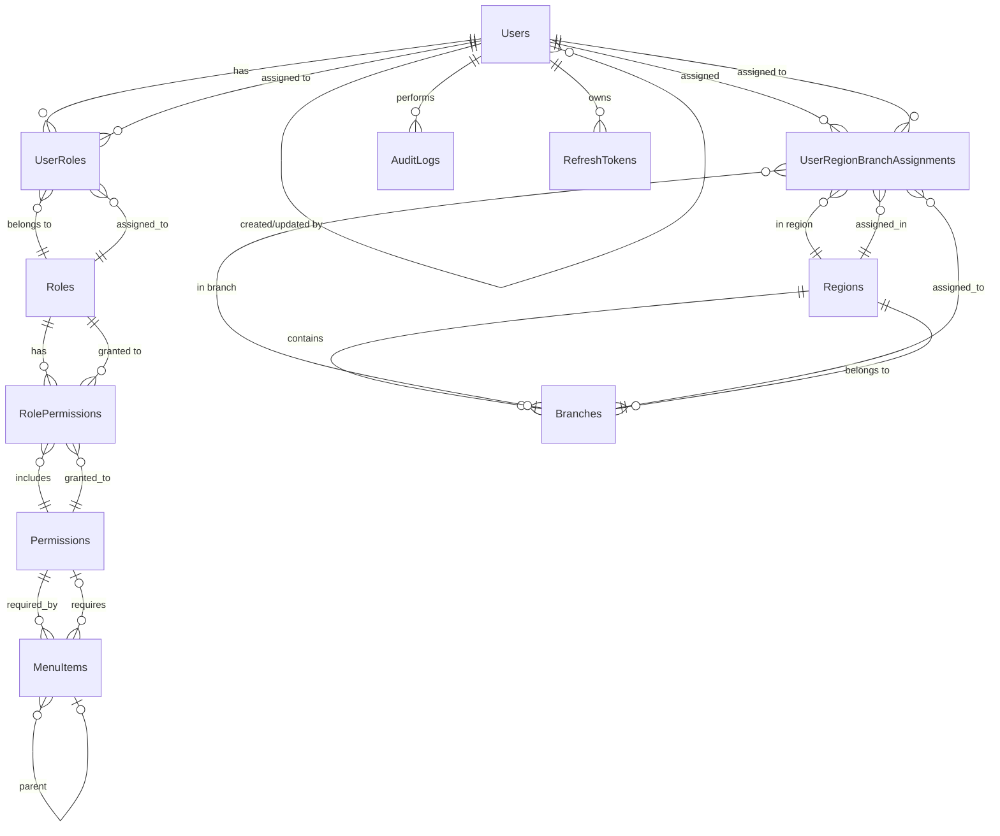

#Week 1-3 Implementation Plan & Complete API System

## Part A: Week 1-3 Detailed Implementation Plan

### Week 1-2: Foundation Phase

#### Day 1-2: Authentication Context & Types

**Task 1.1: Create Authentication Types**

- **File**: `src/types/auth.ts`
- Define interfaces:
- `User` (id, email, firstName, lastName, roles, permissions, regions, branches)
- `LoginRequest`, `LoginResponse`
- `RegisterRequest`, `RegisterResponse`
- `RefreshTokenRequest`, `RefreshTokenResponse`
- `JwtPayload` (extended with user info, regions, branches, permissions)
- `AuthState`

**Task 1.2: Create AuthContext**

- **File**: `src/context/AuthContext.tsx`
- Features:
- JWT token storage (access + refresh tokens)
- User state management
- Auto token refresh (before expiry)
- Session persistence (localStorage with encryption)
- Auto-logout on token expiry
- Login/logout functions
- Token validation

**Task 1.3: Create Auth Utilities**

- **File**: `src/utils/auth.ts`
- Functions:
- `decodeJwt(token)` - decode and validate JWT
- `isTokenExpired(token)` - check expiry
- `getStoredTokens()` - retrieve from storage
- `clearAuthData()` - cleanup on logout

#### Day 3-4: Protected Routes & Route Guards

**Task 1.4: Create ProtectedRoute Component**

- **File**: `src/components/auth/ProtectedRoute.tsx`
- Features:
- Check authentication status
- Redirect to `/signin` if not authenticated
- Optional role-based protection
- Optional permission-based protection
- Loading state during auth check

**Task 1.5: Create RequirePermission Component**

- **File**: `src/components/common/RequirePermission.tsx`
- Features:
- Hide/show UI based on permissions
- Support for multiple permissions (AND/OR logic)

**Task 1.6: Update App.tsx**

- Wrap protected routes with `ProtectedRoute`
- Add public routes (signin, signup, forgot-password, reset-password)
- Implement route-based role checking

**Task 1.7: Create Permission Utilities**

- **File**: `src/utils/permissions.ts`
- Functions:
- `hasPermission(user, permission)`
- `hasRole(user, role)`
- `hasAnyPermission(user, permissions[])`
- `hasAllPermissions(user, permissions[])`

#### Day 5-7: Authentication Forms Enhancement

**Task 1.8: Install Form Libraries**

```bash
npm install react-hook-form zod @hookform/resolvers
```

**Task 1.9: Create Validation Schemas**

- **File**: `src/utils/validation/schemas.ts`
- Schemas:
- `loginSchema` (email, password)
- `registerSchema` (email, password, confirmPassword, firstName, lastName)
- `forgotPasswordSchema` (email)
- `resetPasswordSchema` (token, password, confirmPassword)

**Task 1.10: Update SignInForm**

- **File**: `src/components/auth/SignInForm.tsx`
- Changes:
- Replace useState with react-hook-form
- Add zod validation
- Connect to auth API
- Handle loading/error states
- Implement "Remember me" functionality
- Add OAuth button handlers (structure for Google/Microsoft)

**Task 1.11: Update SignUpForm**

- **File**: `src/components/auth/SignUpForm.tsx`
- Changes:
- Add comprehensive validation
- Password strength indicator
- Email format validation
- Connect to register API

**Task 1.12: Create ForgotPasswordForm**

- **File**: `src/components/auth/ForgotPasswordForm.tsx`
- Features:
- Email input with validation
- Submit to forgot-password API
- Success message display

**Task 1.13: Create ResetPasswordForm**

- **File**: `src/components/auth/ResetPasswordForm.tsx`
- Features:
- Token validation from URL params
- New password + confirm password
- Password strength requirements
- Submit to reset-password API

#### Day 8-10: Role-Based Access Control

**Task 1.14: Update Sidebar with RBAC**

- **File**: `src/layout/AppSidebar.tsx`
- Changes:
- Filter menu items based on user permissions
- Dynamic sidebar based on roles
- Hide menu items user doesn't have access to
- Load menu structure from API (for dynamic menus)

**Task 1.15: Create Role Management Utilities**

- **File**: `src/utils/roles.ts`
- Functions:
- `getUserRoles(user)`
- `hasRole(user, role)`
- `getRoleHierarchy()`
- `canAccessResource(user, resource)`

**Task 1.16: Update Header with User Info**

- **File**: `src/layout/AppHeader.tsx`
- Changes:
- Display user name from AuthContext
- Show user roles
- Add logout functionality

#### Day 11-14: API Client & Services Foundation

**Task 2.1: Install API Dependencies**

```bash
npm install axios
```

**Task 2.2: Create API Client**

- **File**: `src/services/api/client.ts`
- Features:
- Axios instance with base URL from env
- Request interceptor (add JWT token)
- Response interceptor (handle errors, refresh tokens)
- Error handling (401 → logout, 403 → permission error)
- Request timeout (30s)
- Retry logic for network errors

**Task 2.3: Create API Types**

- **File**: `src/services/api/types.ts`
- Types:
- `ApiResponse<T>` (success, data, message)
- `ApiError` (code, message, details)
- `PaginatedResponse<T>` (data, pagination)
- `PaginationParams` (page, pageSize, sortBy, sortOrder)

**Task 2.4: Create Auth API Service**

- **File**: `src/services/api/auth.ts`
- Functions:
- `login(email, password)`
- `register(userData)`
- `logout()`
- `refreshToken(refreshToken)`
- `forgotPassword(email)`
- `resetPassword(token, newPassword)`
- `validateToken(token)`

**Task 2.5: Create User API Service**

- **File**: `src/services/api/users.ts`
- Functions:
- `getUsers(params)` - with pagination, filtering
- `getUserById(id)`
- `createUser(userData)`
- `updateUser(id, userData)`
- `deleteUser(id)`
- `assignRegionsBranches(userId, assignments)`
- `getUserRegionsBranches(userId)`

**Task 2.6: Create Region & Branch API Services**

- **File**: `src/services/api/regions.ts`
- **File**: `src/services/api/branches.ts`
- Functions for CRUD operations with pagination

**Task 2.7: Create Menu API Service**

- **File**: `src/services/api/menus.ts`
- Functions:
- `getMenuStructure()` - hierarchical menu
- `getMenuByPermission(permissions[])` - filtered by permissions

### Week 3: Integration Phase

#### Day 15-17: React Query Integration

**Task 2.8: Install React Query**

```bash
npm install @tanstack/react-query
```

**Task 2.9: Create Query Provider**

- **File**: `src/providers/QueryProvider.tsx`
- Features:
- React Query client setup
- Default query options (staleTime, cacheTime)
- Global error handling
- Retry configuration

**Task 2.10: Create Custom Hooks for Data Fetching**

- **File**: `src/hooks/api/useAuth.ts`
- `useLogin()`, `useLogout()`, `useRegister()`
- **File**: `src/hooks/api/useUsers.ts`
- `useUsers()`, `useUser(id)`, `useCreateUser()`, `useUpdateUser()`, `useDeleteUser()`
- **File**: `src/hooks/api/useRegions.ts`
- **File**: `src/hooks/api/useBranches.ts`
- **File**: `src/hooks/api/useMenus.ts`

**Task 2.11: Update main.tsx**

- Wrap app with QueryProvider
- Wrap app with AuthProvider
- Add ErrorBoundary

**Task 2.12: Environment Configuration**

- **File**: `.env.example`
  ```javascript
                              VITE_API_BASE_URL=http://localhost:5000/api
                              VITE_API_TIMEOUT=30000
                              VITE_APP_NAME=Admin Panel
  ```


- **File**: `.env.local` (gitignored)
- Update `vite.config.ts` if needed

#### Day 18-21: Loading & Error Handling

**Task 3.1: Create Loading Components**

- **File**: `src/components/common/LoadingSpinner.tsx`
- Reusable spinner component
- **File**: `src/components/common/SkeletonLoader.tsx`
- Table skeleton
- Card skeleton
- Form skeleton

**Task 3.2: Create Error Boundary**

- **File**: `src/components/common/ErrorBoundary.tsx`
- Features:
- Catch React errors
- Display fallback UI
- Log errors to monitoring service
- Reset functionality

**Task 3.3: Install Toast Library**

```bash
npm install react-hot-toast
```

**Task 3.4: Create Toast Utilities**

- **File**: `src/utils/toast.ts`
- Functions:
- `showSuccess(message)`
- `showError(message)`
- `showInfo(message)`
- `showWarning(message)`

**Task 3.5: Create Error Handler**

- **File**: `src/utils/errorHandler.ts`
- Features:
- Centralized error handling
- Error classification (network, validation, server, auth)
- User-friendly error messages
- Error logging

**Task 3.6: Update Components with Loading/Error States**

- Update all API-calling components
- Add loading spinners
- Add error handling
- Add toast notifications

---

## Part B: Complete Database Schema

### Database: SQL Server / PostgreSQL

```sql
-- =============================================
-- USERS & AUTHENTICATION
-- =============================================

CREATE TABLE Users (
    Id UNIQUEIDENTIFIER PRIMARY KEY DEFAULT NEWID(),
    Email NVARCHAR(255) NOT NULL UNIQUE,
    PasswordHash NVARCHAR(255) NOT NULL,
    FirstName NVARCHAR(100) NOT NULL,
    LastName NVARCHAR(100) NOT NULL,
    PhoneNumber NVARCHAR(20),
    IsActive BIT NOT NULL DEFAULT 1,
    IsEmailVerified BIT NOT NULL DEFAULT 0,
    EmailVerifiedAt DATETIME2,
    LastLoginAt DATETIME2,
    CreatedAt DATETIME2 NOT NULL DEFAULT GETUTCDATE(),
    UpdatedAt DATETIME2 NOT NULL DEFAULT GETUTCDATE(),
    CreatedBy UNIQUEIDENTIFIER,
    UpdatedBy UNIQUEIDENTIFIER,
    CONSTRAINT FK_Users_CreatedBy FOREIGN KEY (CreatedBy) REFERENCES Users(Id),
    CONSTRAINT FK_Users_UpdatedBy FOREIGN KEY (UpdatedBy) REFERENCES Users(Id)
);

CREATE TABLE Roles (
    Id UNIQUEIDENTIFIER PRIMARY KEY DEFAULT NEWID(),
    Name NVARCHAR(100) NOT NULL UNIQUE,
    Description NVARCHAR(500),
    IsSystemRole BIT NOT NULL DEFAULT 0,
    CreatedAt DATETIME2 NOT NULL DEFAULT GETUTCDATE(),
    UpdatedAt DATETIME2 NOT NULL DEFAULT GETUTCDATE()
);

CREATE TABLE UserRoles (
    Id UNIQUEIDENTIFIER PRIMARY KEY DEFAULT NEWID(),
    UserId UNIQUEIDENTIFIER NOT NULL,
    RoleId UNIQUEIDENTIFIER NOT NULL,
    AssignedAt DATETIME2 NOT NULL DEFAULT GETUTCDATE(),
    AssignedBy UNIQUEIDENTIFIER,
    CONSTRAINT FK_UserRoles_User FOREIGN KEY (UserId) REFERENCES Users(Id) ON DELETE CASCADE,
    CONSTRAINT FK_UserRoles_Role FOREIGN KEY (RoleId) REFERENCES Roles(Id) ON DELETE CASCADE,
    CONSTRAINT FK_UserRoles_AssignedBy FOREIGN KEY (AssignedBy) REFERENCES Users(Id),
    CONSTRAINT UK_UserRoles_User_Role UNIQUE (UserId, RoleId)
);

CREATE TABLE Permissions (
    Id UNIQUEIDENTIFIER PRIMARY KEY DEFAULT NEWID(),
    Name NVARCHAR(100) NOT NULL UNIQUE,
    Description NVARCHAR(500),
    Resource NVARCHAR(100) NOT NULL, -- e.g., 'Users', 'Regions', 'Branches'
    Action NVARCHAR(50) NOT NULL, -- e.g., 'Create', 'Read', 'Update', 'Delete'
    CreatedAt DATETIME2 NOT NULL DEFAULT GETUTCDATE()
);

CREATE TABLE RolePermissions (
    Id UNIQUEIDENTIFIER PRIMARY KEY DEFAULT NEWID(),
    RoleId UNIQUEIDENTIFIER NOT NULL,
    PermissionId UNIQUEIDENTIFIER NOT NULL,
    CONSTRAINT FK_RolePermissions_Role FOREIGN KEY (RoleId) REFERENCES Roles(Id) ON DELETE CASCADE,
    CONSTRAINT FK_RolePermissions_Permission FOREIGN KEY (PermissionId) REFERENCES Permissions(Id) ON DELETE CASCADE,
    CONSTRAINT UK_RolePermissions_Role_Permission UNIQUE (RoleId, PermissionId)
);

-- =============================================
-- REGIONS & BRANCHES
-- =============================================

CREATE TABLE Regions (
    Id UNIQUEIDENTIFIER PRIMARY KEY DEFAULT NEWID(),
    Code NVARCHAR(50) NOT NULL UNIQUE, -- e.g., 'BB1/KH0010002/BATTAMBANG RO'
    Name NVARCHAR(255) NOT NULL,
    Description NVARCHAR(500),
    IsActive BIT NOT NULL DEFAULT 1,
    CreatedAt DATETIME2 NOT NULL DEFAULT GETUTCDATE(),
    UpdatedAt DATETIME2 NOT NULL DEFAULT GETUTCDATE(),
    CreatedBy UNIQUEIDENTIFIER,
    UpdatedBy UNIQUEIDENTIFIER,
    CONSTRAINT FK_Regions_CreatedBy FOREIGN KEY (CreatedBy) REFERENCES Users(Id),
    CONSTRAINT FK_Regions_UpdatedBy FOREIGN KEY (UpdatedBy) REFERENCES Users(Id)
);

CREATE TABLE Branches (
    Id UNIQUEIDENTIFIER PRIMARY KEY DEFAULT NEWID(),
    RegionId UNIQUEIDENTIFIER NOT NULL,
    Code NVARCHAR(50) NOT NULL, -- e.g., 'YTP/KH0010220/BB-THMA PUOK'
    Name NVARCHAR(255) NOT NULL,
    Description NVARCHAR(500),
    Address NVARCHAR(500),
    PhoneNumber NVARCHAR(20),
    IsActive BIT NOT NULL DEFAULT 1,
    CreatedAt DATETIME2 NOT NULL DEFAULT GETUTCDATE(),
    UpdatedAt DATETIME2 NOT NULL DEFAULT GETUTCDATE(),
    CreatedBy UNIQUEIDENTIFIER,
    UpdatedBy UNIQUEIDENTIFIER,
    CONSTRAINT FK_Branches_Region FOREIGN KEY (RegionId) REFERENCES Regions(Id) ON DELETE CASCADE,
    CONSTRAINT FK_Branches_CreatedBy FOREIGN KEY (CreatedBy) REFERENCES Users(Id),
    CONSTRAINT FK_Branches_UpdatedBy FOREIGN KEY (UpdatedBy) REFERENCES Users(Id),
    CONSTRAINT UK_Branches_Code UNIQUE (Code)
);

-- =============================================
-- USER-REGION-BRANCH ASSIGNMENTS
-- =============================================

CREATE TABLE UserRegionBranchAssignments (
    Id UNIQUEIDENTIFIER PRIMARY KEY DEFAULT NEWID(),
    UserId UNIQUEIDENTIFIER NOT NULL,
    RegionId UNIQUEIDENTIFIER NOT NULL,
    BranchId UNIQUEIDENTIFIER NULL, -- NULL means access to all branches in region
    IsActive BIT NOT NULL DEFAULT 1,
    AssignedAt DATETIME2 NOT NULL DEFAULT GETUTCDATE(),
    AssignedBy UNIQUEIDENTIFIER,
    CONSTRAINT FK_UserRegionBranch_User FOREIGN KEY (UserId) REFERENCES Users(Id) ON DELETE CASCADE,
    CONSTRAINT FK_UserRegionBranch_Region FOREIGN KEY (RegionId) REFERENCES Regions(Id) ON DELETE CASCADE,
    CONSTRAINT FK_UserRegionBranch_Branch FOREIGN KEY (BranchId) REFERENCES Branches(Id) ON DELETE CASCADE,
    CONSTRAINT FK_UserRegionBranch_AssignedBy FOREIGN KEY (AssignedBy) REFERENCES Users(Id),
    CONSTRAINT UK_UserRegionBranch UNIQUE (UserId, RegionId, BranchId)
);

-- =============================================
-- DYNAMIC MENU STRUCTURE
-- =============================================

CREATE TABLE MenuItems (
    Id UNIQUEIDENTIFIER PRIMARY KEY DEFAULT NEWID(),
    ParentId UNIQUEIDENTIFIER NULL, -- NULL for root level items
    Name NVARCHAR(100) NOT NULL,
    DisplayName NVARCHAR(255) NOT NULL,
    Icon NVARCHAR(100), -- Icon name or class
    Path NVARCHAR(255), -- Route path
    OrderIndex INT NOT NULL DEFAULT 0,
    IsVisible BIT NOT NULL DEFAULT 1,
    RequiredPermissionId UNIQUEIDENTIFIER NULL, -- NULL = no permission required
    ComponentName NVARCHAR(255), -- React component name
    CreatedAt DATETIME2 NOT NULL DEFAULT GETUTCDATE(),
    UpdatedAt DATETIME2 NOT NULL DEFAULT GETUTCDATE(),
    CONSTRAINT FK_MenuItems_Parent FOREIGN KEY (ParentId) REFERENCES MenuItems(Id) ON DELETE CASCADE,
    CONSTRAINT FK_MenuItems_Permission FOREIGN KEY (RequiredPermissionId) REFERENCES Permissions(Id)
);

-- =============================================
-- AUDIT LOGS
-- =============================================

CREATE TABLE AuditLogs (
    Id UNIQUEIDENTIFIER PRIMARY KEY DEFAULT NEWID(),
    UserId UNIQUEIDENTIFIER NULL, -- NULL for system actions
    Action NVARCHAR(100) NOT NULL, -- 'Create', 'Update', 'Delete', 'Login', 'Logout'
    EntityType NVARCHAR(100) NOT NULL, -- 'User', 'Region', 'Branch', etc.
    EntityId UNIQUEIDENTIFIER NULL,
    OldValues NVARCHAR(MAX), -- JSON
    NewValues NVARCHAR(MAX), -- JSON
    IpAddress NVARCHAR(50),
    UserAgent NVARCHAR(500),
    CreatedAt DATETIME2 NOT NULL DEFAULT GETUTCDATE(),
    CONSTRAINT FK_AuditLogs_User FOREIGN KEY (UserId) REFERENCES Users(Id) ON DELETE SET NULL
);

CREATE INDEX IX_AuditLogs_UserId ON AuditLogs(UserId);
CREATE INDEX IX_AuditLogs_EntityType_EntityId ON AuditLogs(EntityType, EntityId);
CREATE INDEX IX_AuditLogs_CreatedAt ON AuditLogs(CreatedAt);

-- =============================================
-- SYSTEM SETTINGS
-- =============================================

CREATE TABLE SystemSettings (
    Id UNIQUEIDENTIFIER PRIMARY KEY DEFAULT NEWID(),
    Key NVARCHAR(100) NOT NULL UNIQUE,
    Value NVARCHAR(MAX),
    Description NVARCHAR(500),
    Category NVARCHAR(100), -- 'General', 'Security', 'Email', etc.
    IsEncrypted BIT NOT NULL DEFAULT 0,
    UpdatedAt DATETIME2 NOT NULL DEFAULT GETUTCDATE(),
    UpdatedBy UNIQUEIDENTIFIER,
    CONSTRAINT FK_SystemSettings_UpdatedBy FOREIGN KEY (UpdatedBy) REFERENCES Users(Id)
);

-- =============================================
-- REFRESH TOKENS
-- =============================================

CREATE TABLE RefreshTokens (
    Id UNIQUEIDENTIFIER PRIMARY KEY DEFAULT NEWID(),
    UserId UNIQUEIDENTIFIER NOT NULL,
    Token NVARCHAR(500) NOT NULL UNIQUE,
    ExpiresAt DATETIME2 NOT NULL,
    IsRevoked BIT NOT NULL DEFAULT 0,
    RevokedAt DATETIME2 NULL,
    CreatedAt DATETIME2 NOT NULL DEFAULT GETUTCDATE(),
    CreatedByIp NVARCHAR(50),
    CONSTRAINT FK_RefreshTokens_User FOREIGN KEY (UserId) REFERENCES Users(Id) ON DELETE CASCADE
);

CREATE INDEX IX_RefreshTokens_UserId ON RefreshTokens(UserId);
CREATE INDEX IX_RefreshTokens_Token ON RefreshTokens(Token);
```


### ERD Diagram (Mermaid)



---

## Part C: JWT Token Structure

### JWT Payload (Include all necessary info for microservice validation)

```typescript
interface JwtPayload {
  // Standard claims
  sub: string; // User ID
  email: string;
  iat: number; // Issued at
  exp: number; // Expiration
  jti: string; // JWT ID (for revocation)
  
  // Custom claims
  userId: string; // User GUID
  firstName: string;
  lastName: string;
  roles: string[]; // ['Admin', 'Manager', 'User']
  permissions: string[]; // ['Users.Create', 'Users.Read', 'Regions.Read']
  
  // Region-Branch access
  regions: Array<{
    regionId: string;
    regionCode: string;
    regionName: string;
    branches: Array<{
      branchId: string;
      branchCode: string;
      branchName: string;
    }> | null; // null = all branches in region
  }>;
  
  // Session info
  sessionId: string;
  deviceId?: string;
  
  // Security
  tokenVersion: number; // For token invalidation
  ipAddress?: string;
}
```


### Example JWT Token

```json
{
  "sub": "4D7E5B41-8F2C-4A9B-9E1D-3C5F7A9B1D2E",
  "email": "admin@example.com",
  "iat": 1704067200,
  "exp": 1704153600,
  "jti": "550e8400-e29b-41d4-a716-446655440000",
  "userId": "4D7E5B41-8F2C-4A9B-9E1D-3C5F7A9B1D2E",
  "firstName": "Sok",
  "lastName": "Chan",
  "roles": ["Admin", "RegionalManager"],
  "permissions": [
    "Users.Create",
    "Users.Read",
    "Users.Update",
    "Users.Delete",
    "Regions.Create",
    "Regions.Read",
    "Regions.Update",
    "Branches.Create",
    "Branches.Read",
    "Branches.Update"
  ],
  "regions": [
    {
      "regionId": "BB1-REGION-001",
      "regionCode": "BB1/KH0010002/BATTAMBANG RO",
      "regionName": "Battambang Region",
      "branches": [
        {
          "branchId": "YTP-BRANCH-001",
          "branchCode": "YTP/KH0010220/BB-THMA PUOK",
          "branchName": "Thma Puok Branch"
        },
        {
          "branchId": "BTK-BRANCH-001",
          "branchCode": "BTK/KH0010217/BB-THMA KOUL",
          "branchName": "Thma Koul Branch"
        }
      ]
    }
  ],
  "sessionId": "SESSION-001",
  "tokenVersion": 1,
  "ipAddress": "192.168.1.100"
}
```

---

## Part D: 69+ API Endpoints with Dummy JSON

### Authentication Endpoints (6)

#### 1. POST /api/auth/login

**Request:**

```json
{
  "email": "admin@example.com",
  "password": "Admin@123",
  "rememberMe": true
}
```

**Response (200):**

```json
{
  "success": true,
  "data": {
    "accessToken": "eyJhbGciOiJIUzI1NiIsInR5cCI6IkpXVCJ9...",
    "refreshToken": "eyJhbGciOiJIUzI1NiIsInR5cCI6IkpXVCJ9...",
    "expiresIn": 3600,
    "user": {
      "id": "4D7E5B41-8F2C-4A9B-9E1D-3C5F7A9B1D2E",
      "email": "admin@example.com",
      "firstName": "Sok",
      "lastName": "Chan",
      "roles": ["Admin"],
      "permissions": ["Users.Create", "Users.Read", "Users.Update", "Users.Delete"],
      "regions": [
        {
          "regionId": "BB1-REGION-001",
          "regionCode": "BB1/KH0010002/BATTAMBANG RO",
          "regionName": "Battambang Region",
          "branches": [
            {
              "branchId": "YTP-BRANCH-001",
              "branchCode": "YTP/KH0010220/BB-THMA PUOK",
              "branchName": "Thma Puok Branch"
            }
          ]
        }
      ]
    }
  },
  "message": "Login successful"
}
```

**Error Response (401):**

```json
{
  "success": false,
  "error": {
    "code": "INVALID_CREDENTIALS",
    "message": "Invalid email or password",
    "details": null
  }
}
```


#### 2. POST /api/auth/register

**Request:**

```json
{
  "email": "newuser@example.com",
  "password": "Password@123",
  "confirmPassword": "Password@123",
  "firstName": "Dara",
  "lastName": "Sok",
  "phoneNumber": "+855123456789"
}
```

**Response (201):**

```json
{
  "success": true,
  "data": {
    "userId": "NEW-USER-ID-001",
    "email": "newuser@example.com",
    "emailVerificationRequired": true
  },
  "message": "User registered successfully. Please verify your email."
}
```


#### 3. POST /api/auth/refresh-token

**Request:**

```json
{
  "refreshToken": "eyJhbGciOiJIUzI1NiIsInR5cCI6IkpXVCJ9..."
}
```

**Response (200):**

```json
{
  "success": true,
  "data": {
    "accessToken": "NEW-ACCESS-TOKEN...",
    "refreshToken": "NEW-REFRESH-TOKEN...",
    "expiresIn": 3600
  }
}
```


#### 4. POST /api/auth/logout

**Response (200):**

```json
{
  "success": true,
  "message": "Logged out successfully"
}
```


#### 5. POST /api/auth/forgot-password

**Request:**

```json
{
  "email": "user@example.com"
}
```

**Response (200):**

```json
{
  "success": true,
  "message": "Password reset email sent"
}
```


#### 6. POST /api/auth/reset-password

**Request:**

```json
{
  "token": "RESET-TOKEN-123",
  "newPassword": "NewPassword@123",
  "confirmPassword": "NewPassword@123"
}
```

**Response (200):**

```json
{
  "success": true,
  "message": "Password reset successfully"
}
```


### User Management Endpoints (12)

#### 7. GET /api/users

**Query Params:** `?page=1&pageSize=10&sortBy=firstName&sortOrder=asc&search=sok&isActive=true&roleId=ROLE-001`**Response (200):**

```json
{
  "success": true,
  "data": {
    "items": [
      {
        "id": "4D7E5B41-8F2C-4A9B-9E1D-3C5F7A9B1D2E",
        "email": "admin@example.com",
        "firstName": "Sok",
        "lastName": "Chan",
        "phoneNumber": "+855123456789",
        "isActive": true,
        "isEmailVerified": true,
        "roles": [
          {
            "id": "ROLE-001",
            "name": "Admin",
            "description": "System Administrator"
          }
        ],
        "lastLoginAt": "2024-01-15T10:30:00Z",
        "createdAt": "2024-01-01T08:00:00Z",
        "createdBy": {
          "id": "SYSTEM",
          "name": "System"
        }
      }
    ],
    "pagination": {
      "page": 1,
      "pageSize": 10,
      "totalItems": 5,
      "totalPages": 1,
      "hasNextPage": false,
      "hasPreviousPage": false
    }
  }
}
```


#### 8. GET /api/users/:id

**Response (200):**

```json
{
  "success": true,
  "data": {
    "id": "4D7E5B41-8F2C-4A9B-9E1D-3C5F7A9B1D2E",
    "email": "admin@example.com",
    "firstName": "Sok",
    "lastName": "Chan",
    "phoneNumber": "+855123456789",
    "isActive": true,
    "isEmailVerified": true,
    "roles": [
      {
        "id": "ROLE-001",
        "name": "Admin"
      }
    ],
    "regions": [
      {
        "regionId": "BB1-REGION-001",
        "regionCode": "BB1/KH0010002/BATTAMBANG RO",
        "regionName": "Battambang Region",
        "branches": [
          {
            "branchId": "YTP-BRANCH-001",
            "branchCode": "YTP/KH0010220/BB-THMA PUOK",
            "branchName": "Thma Puok Branch"
          }
        ]
      }
    ],
    "createdAt": "2024-01-01T08:00:00Z",
    "updatedAt": "2024-01-15T10:30:00Z"
  }
}
```


#### 9. POST /api/users

**Request:**

```json
{
  "email": "newuser@example.com",
  "password": "Password@123",
  "firstName": "Dara",
  "lastName": "Sok",
  "phoneNumber": "+855987654321",
  "roleIds": ["ROLE-002"],
  "regionBranchAssignments": [
    {
      "regionId": "BB1-REGION-001",
      "branchIds": ["YTP-BRANCH-001", "BTK-BRANCH-001"]
    }
  ]
}
```

**Response (201):**

```json
{
  "success": true,
  "data": {
    "id": "NEW-USER-ID-002",
    "email": "newuser@example.com",
    "firstName": "Dara",
    "lastName": "Sok"
  },
  "message": "User created successfully"
}
```


#### 10. PUT /api/users/:id

**Request:**

```json
{
  "firstName": "Updated First Name",
  "lastName": "Updated Last Name",
  "phoneNumber": "+855111222333",
  "isActive": true
}
```

**Response (200):**

```json
{
  "success": true,
  "data": {
    "id": "4D7E5B41-8F2C-4A9B-9E1D-3C5F7A9B1D2E",
    "firstName": "Updated First Name",
    "lastName": "Updated Last Name"
  },
  "message": "User updated successfully"
}
```


#### 11. DELETE /api/users/:id

**Response (200):**

```json
{
  "success": true,
  "message": "User deleted successfully"
}
```


#### 12. POST /api/users/:id/assign-roles

**Request:**

```json
{
  "roleIds": ["ROLE-001", "ROLE-002"]
}
```


#### 13. POST /api/users/:id/assign-regions-branches

**Request:**

```json
{
  "assignments": [
    {
      "regionId": "BB1-REGION-001",
      "branchIds": ["YTP-BRANCH-001", "BTK-BRANCH-001"]
    },
    {
      "regionId": "PP1-REGION-001",
      "branchIds": null
    }
  ]
}
```


#### 14. GET /api/users/:id/regions-branches

**Response (200):**

```json
{
  "success": true,
  "data": {
    "userId": "4D7E5B41-8F2C-4A9B-9E1D-3C5F7A9B1D2E",
    "assignments": [
      {
        "regionId": "BB1-REGION-001",
        "regionCode": "BB1/KH0010002/BATTAMBANG RO",
        "regionName": "Battambang Region",
        "branches": [
          {
            "branchId": "YTP-BRANCH-001",
            "branchCode": "YTP/KH0010220/BB-THMA PUOK",
            "branchName": "Thma Puok Branch"
          }
        ],
        "hasAllBranches": false
      }
    ]
  }
}
```


#### 15. PUT /api/users/:id/activate

#### 16. PUT /api/users/:id/deactivate

#### 17. POST /api/users/:id/reset-password

#### 18. GET /api/users/:id/audit-logs

### Region Management Endpoints (8)

#### 19. GET /api/regions

**Query Params:** `?page=1&pageSize=10&search=battambang&isActive=true`**Response (200):**

```json
{
  "success": true,
  "data": {
    "items": [
      {
        "id": "BB1-REGION-001",
        "code": "BB1/KH0010002/BATTAMBANG RO",
        "name": "Battambang Region",
        "description": "Battambang Regional Office",
        "isActive": true,
        "branchCount": 5,
        "createdAt": "2024-01-01T08:00:00Z",
        "createdBy": {
          "id": "4D7E5B41-8F2C-4A9B-9E1D-3C5F7A9B1D2E",
          "name": "Sok Chan"
        }
      }
    ],
    "pagination": {
      "page": 1,
      "pageSize": 10,
      "totalItems": 3,
      "totalPages": 1
    }
  }
}
```


#### 20. GET /api/regions/:id

#### 21. POST /api/regions

**Request:**

```json
{
  "code": "PP1/KH0010001/PHNOM PENH RO",
  "name": "Phnom Penh Region",
  "description": "Phnom Penh Regional Office"
}
```


#### 22. PUT /api/regions/:id

#### 23. DELETE /api/regions/:id

#### 24. GET /api/regions/:id/branches

#### 25. GET /api/regions/:id/users

#### 26. PUT /api/regions/:id/activate

#### 27. PUT /api/regions/:id/deactivate

### Branch Management Endpoints (8)

#### 28. GET /api/branches

**Query Params:** `?page=1&pageSize=10&regionId=BB1-REGION-001&search=thma&isActive=true`**Response (200):**

```json
{
  "success": true,
  "data": {
    "items": [
      {
        "id": "YTP-BRANCH-001",
        "regionId": "BB1-REGION-001",
        "regionCode": "BB1/KH0010002/BATTAMBANG RO",
        "code": "YTP/KH0010220/BB-THMA PUOK",
        "name": "Thma Puok Branch",
        "description": "Thma Puok Branch Office",
        "address": "Thma Puok District, Battambang Province",
        "phoneNumber": "+855123456789",
        "isActive": true,
        "createdAt": "2024-01-01T08:00:00Z"
      }
    ],
    "pagination": {
      "page": 1,
      "pageSize": 10,
      "totalItems": 5,
      "totalPages": 1
    }
  }
}
```


#### 29. GET /api/branches/:id

#### 30. POST /api/branches

**Request:**

```json
{
  "regionId": "BB1-REGION-001",
  "code": "NEW/KH0010221/BB-NEW BRANCH",
  "name": "New Branch",
  "description": "New Branch Office",
  "address": "New District, Battambang Province",
  "phoneNumber": "+855987654321"
}
```


#### 31. PUT /api/branches/:id

#### 32. DELETE /api/branches/:id

#### 33. GET /api/branches/:id/users

#### 34. PUT /api/branches/:id/activate

#### 35. PUT /api/branches/:id/deactivate

### Role & Permission Management Endpoints (10)

#### 36. GET /api/roles

#### 37. GET /api/roles/:id

#### 38. POST /api/roles

**Request:**

```json
{
  "name": "BranchManager",
  "description": "Branch Manager Role",
  "permissionIds": ["PERM-001", "PERM-002"]
}
```


#### 39. PUT /api/roles/:id

#### 40. DELETE /api/roles/:id

#### 41. GET /api/roles/:id/permissions

#### 42. POST /api/roles/:id/permissions

#### 43. DELETE /api/roles/:id/permissions/:permissionId

#### 44. GET /api/permissions

**Response (200):**

```json
{
  "success": true,
  "data": [
    {
      "id": "PERM-001",
      "name": "Users.Create",
      "description": "Create new users",
      "resource": "Users",
      "action": "Create"
    },
    {
      "id": "PERM-002",
      "name": "Users.Read",
      "description": "View users",
      "resource": "Users",
      "action": "Read"
    }
  ]
}
```


#### 45. GET /api/permissions/resources

### Menu Management Endpoints (6)

#### 46. GET /api/menus

**Response (200):** Returns hierarchical menu structure

```json
{
  "success": true,
  "data": [
    {
      "id": "MENU-001",
      "name": "Dashboard",
      "displayName": "Dashboard",
      "icon": "GridIcon",
      "path": "/",
      "orderIndex": 1,
      "children": []
    },
    {
      "id": "MENU-002",
      "name": "ApplicationData",
      "displayName": "Application Data",
      "icon": "BoxIcon",
      "path": null,
      "orderIndex": 2,
      "requiredPermission": "ApplicationData.Read",
      "children": [
        {
          "id": "MENU-003",
          "name": "CustomerManagement",
          "displayName": "Customer Management",
          "icon": "UserIcon",
          "path": "/customers",
          "orderIndex": 1,
          "requiredPermission": "Customers.Read",
          "children": []
        },
        {
          "id": "MENU-004",
          "name": "AccountSetup",
          "displayName": "Account Setup",
          "icon": "SettingsIcon",
          "path": "/accounts",
          "orderIndex": 2,
          "requiredPermission": "Accounts.Read",
          "children": []
        }
      ]
    },
    {
      "id": "MENU-005",
      "name": "PrintingTools",
      "displayName": "Printing Tools",
      "icon": "PrinterIcon",
      "path": null,
      "orderIndex": 3,
      "children": [
        {
          "id": "MENU-006",
          "name": "CustomerReports",
          "displayName": "Customer Reports",
          "icon": "FileIcon",
          "path": "/reports/customers",
          "orderIndex": 1,
          "requiredPermission": "Reports.Customers.Read",
          "children": []
        }
      ]
    }
  ]
}
```


#### 47. GET /api/menus/user-menu

**Response (200):** Returns menu filtered by user permissions

#### 48. GET /api/menus/:id

#### 49. POST /api/menus

#### 50. PUT /api/menus/:id

#### 51. DELETE /api/menus/:id

### Audit Log Endpoints (5)

#### 52. GET /api/audit-logs

**Query Params:** `?page=1&pageSize=20&userId=USER-001&entityType=User&action=Create&startDate=2024-01-01&endDate=2024-01-31`**Response (200):**

```json
{
  "success": true,
  "data": {
    "items": [
      {
        "id": "AUDIT-001",
        "userId": "4D7E5B41-8F2C-4A9B-9E1D-3C5F7A9B1D2E",
        "userName": "Sok Chan",
        "action": "Create",
        "entityType": "User",
        "entityId": "NEW-USER-001",
        "oldValues": null,
        "newValues": {
          "email": "newuser@example.com",
          "firstName": "Dara"
        },
        "ipAddress": "192.168.1.100",
        "userAgent": "Mozilla/5.0...",
        "createdAt": "2024-01-15T10:30:00Z"
      }
    ],
    "pagination": {
      "page": 1,
      "pageSize": 20,
      "totalItems": 150,
      "totalPages": 8
    }
  }
}
```


#### 53. GET /api/audit-logs/:id

#### 54. GET /api/audit-logs/entity/:entityType/:entityId

#### 55. GET /api/audit-logs/user/:userId

#### 56. POST /api/audit-logs (for manual logging)

### System Settings Endpoints (5)

#### 57. GET /api/settings

#### 58. GET /api/settings/:key

#### 59. PUT /api/settings/:key

**Request:**

```json
{
  "value": "New Value",
  "description": "Updated description"
}
```


#### 60. GET /api/settings/category/:category

#### 61. POST /api/settings

### Dashboard Analytics Endpoints (4)

#### 62. GET /api/dashboard/stats

**Response (200):**

```json
{
  "success": true,
  "data": {
    "totalUsers": 150,
    "activeUsers": 120,
    "totalRegions": 3,
    "totalBranches": 15,
    "todayLogins": 45,
    "recentActivities": [
      {
        "id": "ACT-001",
        "type": "User Created",
        "description": "New user created: Dara Sok",
        "createdAt": "2024-01-15T10:30:00Z"
      }
    ]
  }
}
```


#### 63. GET /api/dashboard/user-activity

#### 64. GET /api/dashboard/region-statistics

#### 65. GET /api/dashboard/branch-statistics

### Additional Utility Endpoints (4)

#### 66. GET /api/health

**Response (200):**

```json
{
  "status": "healthy",
  "timestamp": "2024-01-15T10:30:00Z",
  "version": "1.0.0"
}
```


#### 67. GET /api/me (Current user info)

#### 68. PUT /api/me (Update current user profile)

#### 69. POST /api/me/change-password

---

## Part E: Mock API Server Setup (JSON Server)

### Setup Instructions

1. **Install JSON Server:**
```bash
npm install -g json-server
```


2. **Create `mock-api/db.json`** with all dummy data
3. **Create `mock-api/routes.json`** for custom routes:
```json
{
  "/api/*": "/$1"
}
```


4. **Create `mock-api/middleware.js`** for JWT simulation:
```javascript
module.exports = (req, res, next) => {
  // Simulate JWT validation
  const authHeader = req.headers.authorization;
  if (authHeader && authHeader.startsWith('Bearer ')) {
    // Allow request
    next();
  } else if (req.path.startsWith('/api/auth/login') || req.path.startsWith('/api/auth/register')) {
    // Allow auth endpoints
    next();
  } else {
    res.status(401).json({ success: false, error: { code: 'UNAUTHORIZED', message: 'Authentication required' } });
  }
};
```


5. **Run JSON Server:**
```bash
json-server --watch mock-api/db.json --routes mock-api/routes.json --middlewares mock-api/middleware.js --port 5000
```


### Dummy Data Structure in db.json

```json
{
  "users": [...],
  "roles": [...],
  "permissions": [...],
  "regions": [...],
  "branches": [...],
  "userRegionBranchAssignments": [...],
  "menuItems": [...],
  "auditLogs": [...],
  "systemSettings": [...]
}
```

---

## Part F: Backend Technology Recommendations

### ASP.NET Core API 9 with JWT

**Recommended Stack:**

- ASP.NET Core 9.0 Web API
- Entity Framework Core 9.0
- SQL Server / PostgreSQL
- JWT Authentication (Microsoft.AspNetCore.Authentication.JwtBearer)
- AutoMapper for DTOs
- FluentValidation for validation
- Serilog for logging
- Swagger/OpenAPI for documentation

**Key Implementation Points:**

1. **JWT Configuration:**
```csharp
services.AddAuthentication(JwtBearerDefaults.AuthenticationScheme)
    .AddJwtBearer(options => {
        options.TokenValidationParameters = new TokenValidationParameters {
            ValidateIssuer = true,
            ValidateAudience = true,
            ValidateLifetime = true,
            ValidateIssuerSigningKey = true,
            ValidIssuer = configuration["Jwt:Issuer"],
            ValidAudience = configuration["Jwt:Audience"],
            IssuerSigningKey = new SymmetricSecurityKey(
                Encoding.UTF8.GetBytes(configuration["Jwt:SecretKey"])
            )
        };
    });
```


2. **JWT Token Generation:**

Include all user info, roles, permissions, regions, branches in claims.

3. **Authorization Policies:**
```csharp
services.AddAuthorization(options => {
    options.AddPolicy("RequireAdmin", policy => 
        policy.RequireRole("Admin"));
    options.AddPolicy("Users.Create", policy => 
        policy.RequireClaim("Permission", "Users.Create"));
});
```


4. **Microservice Validation:**

Other microservices can validate JWT tokens using the same secret key and extract all necessary info from claims without additional API calls.---

## Part G: Frontend Integration Guide

### Step 1: Update Environment Variables

```env
VITE_API_BASE_URL=http://localhost:5000/api
VITE_API_TIMEOUT=30000
```


### Step 2: API Client Setup

Use the API client created in Week 1-2 that automatically injects JWT tokens.

### Step 3: React Query Integration

Use custom hooks created in Week 3 for data fetching.

### Step 4: Dynamic Menu Loading

```typescript
// In AppSidebar.tsx
const { data: menuStructure } = useMenus();
// Filter and render menu based on user permissions
```


### Step 5: Region-Branch Filtering

```typescript
/ In components that need region/branch filtering
const { user } = useAuth();
const userRegions = user?.regions || [];
// Filter data based on user's accessible regions/branches
```

---

## Implementation Checklist

### Week 1-2 Foundation

- [ ] Create authentication types and context
- [ ] Implement protected routes
- [ ] Enhance authentication forms
- [ ] Setup RBAC system
- [ ] Create API client with interceptors